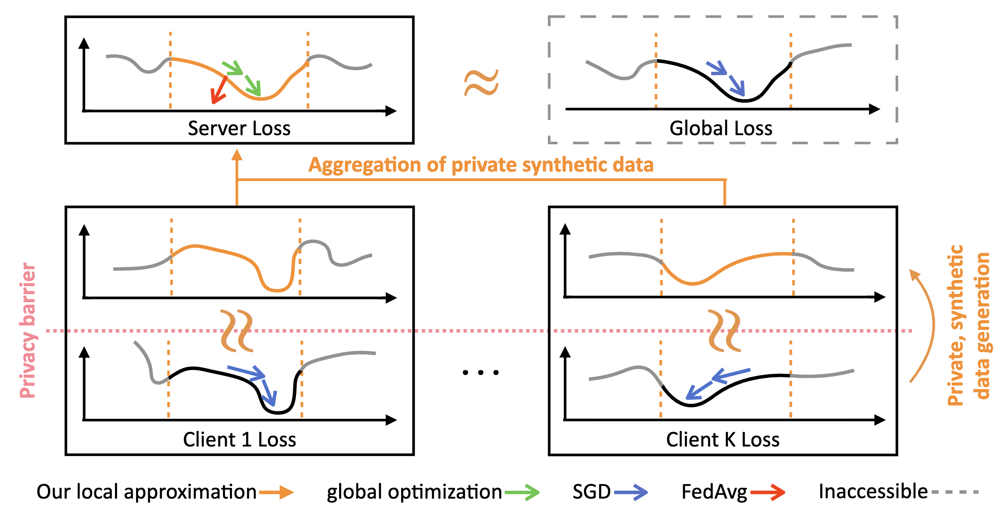

# FedLAP-DP: Federated Learning by Sharing Differentially Private Loss Approximations



> **FedLAP-DP: Federated Learning by Sharing Differentially Private Loss Approximations** (PoPETS 2024) \
> Hui-Po Wang, Dingfan Chen, Raouf Kerkouche, Mario Fritz \
> A novel federated optimization approach overcoming privacy and non-IID challenges via gradient approximation

#### [[Paper (PoPETS 2024)]](https://arxiv.org/abs/2302.01068)

------------------------------------
python -W ignore main.py -cfg settings-fed/convnet/cifar10-dsc-new-cosine.yaml (v)
python -W ignore main.py -cfg settings-fed/convnet/mnist-dsc-new.yaml 
python -W ignore main.py -cfg settings-fed/convnet/fashionmnist-dsc-new.yaml 

python -W ignore main.py -cfg settings-fed/convnet/cifar10-dsc-new-median.yaml
python -W ignore main.py -cfg settings-fed/convnet/cifar10-dsc-new-max.yaml
python -W ignore main.py -cfg settings-fed/convnet/cifar10-dsc-new-fixed.yaml

python -W ignore main.py -cfg settings-fed/convnet/cifar10-dsc-new-dp1-6.yaml (v)

python main_baseline.py -cfg settings-fed/convnet/cifar10-baseline-old.yaml
python -W ignore main_baseline.py -cfg settings-fed/convnet/cifar10-fedprox-dp1.yaml --seed 123
python -W ignore main_baseline.py -cfg settings-fed/convnet/cifar10-baseline-dp1.yaml --seed 123

python main_baseline.py -cfg settings-fed/ready-baselines/cifar10-baseline.yaml
python -W ignore main_baseline.py -cfg settings-fed/ready-baselines/cifar10-baseline-dp1.yaml
------------------------------------
## Quick Start
Follow the instructions below to reproduce the main result of our work quickly.

1. Modify the ```--data-path``` argument in ```main.py``` and ```main_baseline.py``` accordingly (or specify it in the console)
   
3. Set up the environment
   
```
pip install -r requirements.txt
```
 
4. Run the following scripts
   
- FedAvg on CIFAR-10 in non-DP settings 
```
bash script-fed/baseline-nondp.sh
```
- FedLAP on CIFAR-10 in non-DP settings
```
bash script-fed/fedlap-nondp.sh
```
- FedAvg on CIFAR-10 in DP settings 
```
bash script-fed/baseline-dp.sh
```
- FedLAP on CIFAR-10 in DP settings
```
bash script-fed/fedlap-dp.sh
```

------------------------------------

## More Experiments

The ablation studies in the paper can be reproduced by the following instructions, which have been provided in the scripts, e.g., ```script-fed/fedlap-nondp.sh```.

- Radius selection strategies
```
python -W ignore main.py -cfg settings-fed/fedlap/cifar10-fedlap-median.yaml
python -W ignore main.py -cfg settings-fed/fedlap/cifar10-fedlap-max.yaml
python -W ignore main.py -cfg settings-fed/fedlap/cifar10-fedlap-fixed.yaml
```
------------------------------------

## Installation

We provide the environment setup we tested here. This repo might be downward compatible but ```opacus``` must be 0.15.0.

- Pytorch >= 2.3.1
- torchvision >= 0.18.1
- opacus==0.15.0

------------------------------------

## Citation
```
@article{wang2023fedlap,
  title={FedLAP-DP: Federated Learning by Sharing Differentially Private Loss Approximations},
  author={Wang, Hui-Po and Chen, Dingfan and Kerkouche, Raouf and Fritz, Mario},
  journal={Proc. Priv. Enhancing Technol.}
  year={2024}
}
```

------------------------------------

## Acknowledgement
This project is partially built upon [PrivateSet](https://github.com/DingfanChen/Private-Set) and [Dataset Condensation](https://github.com/VICO-UoE/DatasetCondensation)
